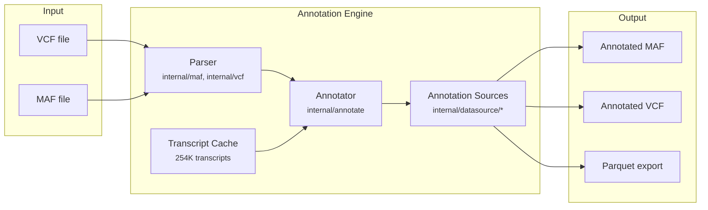
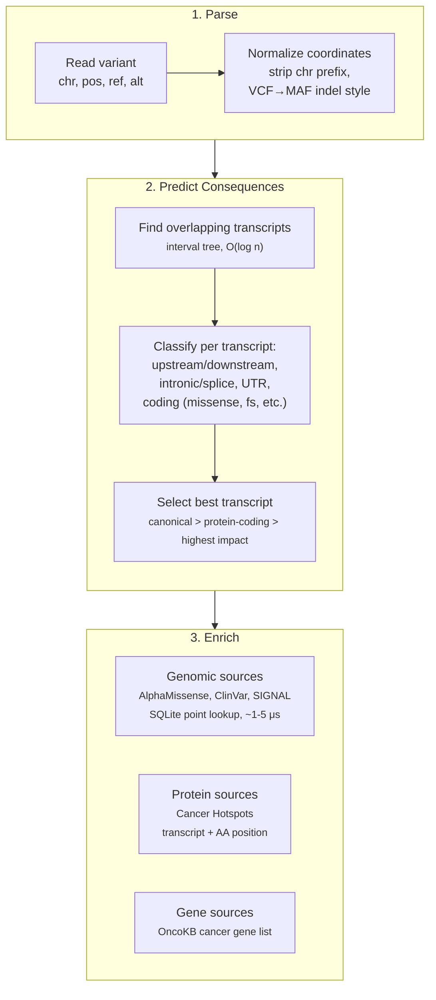
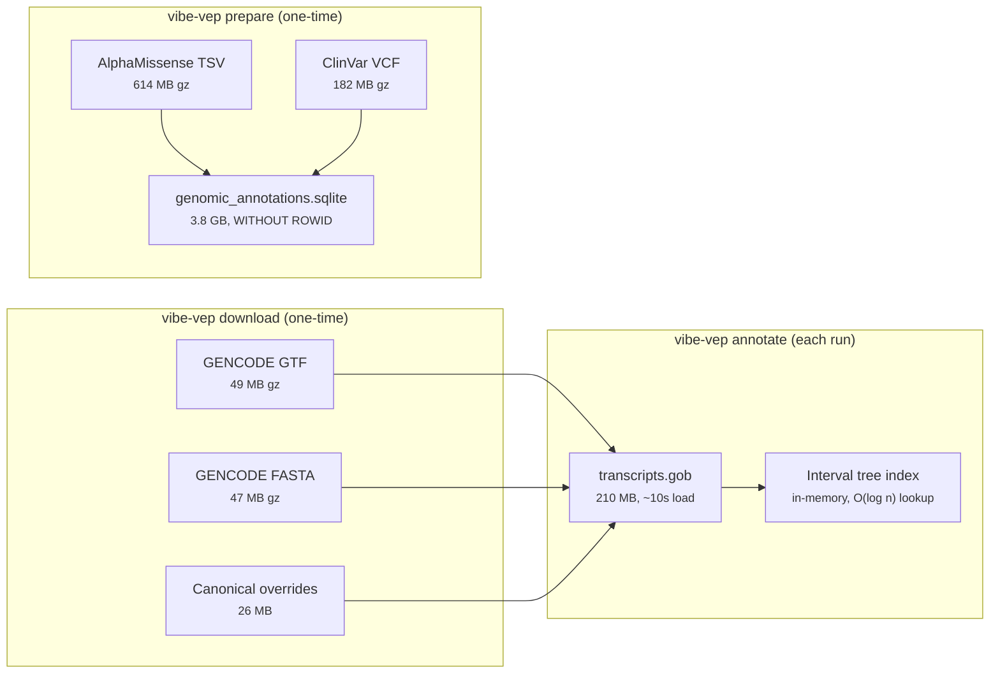
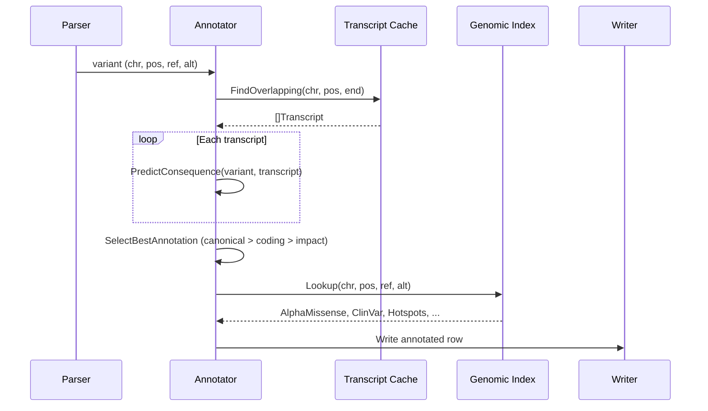
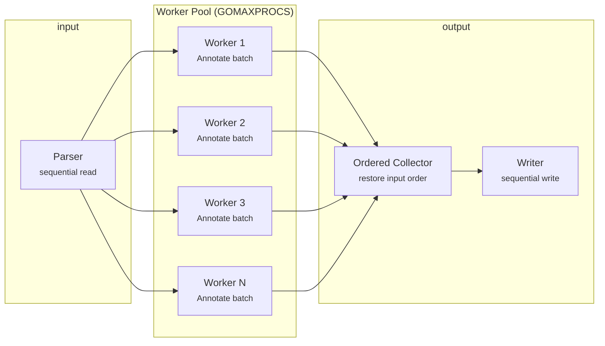
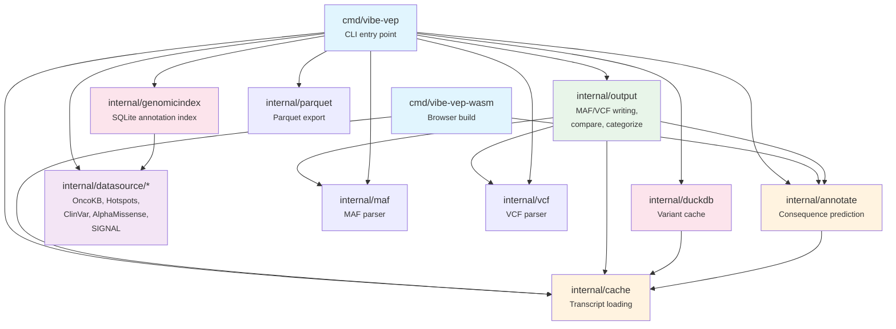

## Overview

vibe-vep is a single Go binary that annotates cancer variants with consequence predictions, protein effects, and clinical annotations. It reads VCF/MAF files, predicts consequences against GENCODE transcripts, and enriches variants with data from multiple annotation sources.



## Annotation Pipeline

Each variant flows through a three-stage pipeline: parsing, consequence prediction, and source enrichment.



## Data Flow

### Startup

On first run, `vibe-vep download` fetches GENCODE annotations. Subsequent runs load from a gob-serialized transcript cache for fast startup (~10s for 254K transcripts vs ~50s from raw GTF/FASTA).



### Per-Variant



## Storage Architecture

All data lives under `~/.vibe-vep/{assembly}/`:

```
~/.vibe-vep/grch38/
  gencode.v46.annotation.gtf.gz         # 49 MB  - GENCODE gene models (source)
  gencode.v46.pc_transcripts.fa.gz      # 47 MB  - protein-coding sequences (source)
  ensembl_biomart_canonical_*.txt        # 26 MB  - canonical transcript overrides (source)
  transcripts.gob                        # 210 MB - serialized transcript cache
  genomic_annotations.sqlite             # 3.8 GB - AlphaMissense + ClinVar + SIGNAL
  variant_cache.duckdb                   # var.   - annotation result cache
```

### Storage Engines

| Engine | File | Purpose | Access Pattern |
|--------|------|---------|---------------|
| **Gob** | `transcripts.gob` | 254K transcripts with exon/CDS/protein data | Full deserialize on startup |
| **SQLite** | `genomic_annotations.sqlite` | 75M+ annotation records (AM + ClinVar + SIGNAL) | mmap point lookups, ~1-5 &mu;s |
| **DuckDB** | `variant_cache.duckdb` | Previously annotated results + Parquet export | Columnar read/write, batch queries |

### SQLite vs DuckDB: Why Two Databases?

**SQLite** (`genomic_annotations.sqlite`) is a **read-only reference database** used *during* annotation. It holds pre-computed data from external sources (AlphaMissense scores, ClinVar significance, SIGNAL frequencies) and is queried once per variant via a point lookup on `(chrom, pos, ref, alt)`. Built once by `vibe-vep prepare`, it uses a `WITHOUT ROWID` clustered primary key for single B-tree traversals served directly from mmap with near-zero Go heap allocation (~1-5 &mu;s per lookup).

**DuckDB** (`variant_cache.duckdb`) stores **annotation results** written *after* annotation. It serves two purposes:

1. **Variant result cache** (`--save-results`): Stores completed annotations so re-annotating the same variant skips prediction. Useful when re-running on overlapping datasets.
2. **Post-annotation analysis** (`--from-cache`, `export parquet`): Enables columnar queries over previously annotated results --- filter by gene, consequence, or clinical significance without re-processing the input file.

In short: SQLite provides input data for the annotation engine, DuckDB captures its output for downstream use.

## Parallelism

Annotation is CPU-bound (consequence prediction per transcript). The annotator supports parallel execution via Go channels:



Variants are dispatched to workers via a buffered channel. Each worker annotates independently (transcript cache and SQLite index are read-only, thread-safe). An ordered collector reassembles results in input order for deterministic output.

**Performance** (4 cores, 1.05M TCGA variants):
- Sequential: ~11K variants/sec
- Parallel: ~16-23K variants/sec (1.5-2x speedup)

## Package Dependencies



## CLI Commands

```
vibe-vep
  annotate          Annotate variants with consequence predictions
    maf             Annotate MAF file
    vcf             Annotate VCF file
    variant         Annotate a single variant
  compare           Compare variant annotations
    maf             Compare two MAF files (with optional --categorize)
    vcf             Compare two VCF files
  convert           Format conversion
    vcf2maf         Convert VCF to MAF format
  download          Download GENCODE + annotation source data
  prepare           Build genomic annotation index (SQLite)
  export            Export to analytical formats
    parquet         Export annotated results to Parquet
  config            Manage configuration
  version           Show version and loaded annotation sources
```
